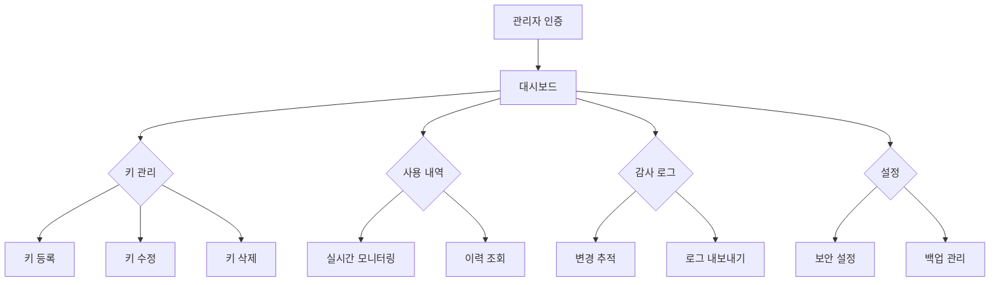

## 1. 제품 개요
관리자 전용 API 키 관리 시스템은 OpenWebUI와 유사한 방식으로 시스템 내에서 API 키를 안전하게 등록, 관리하고 사용 내역을 추적하는 솔루션입니다. .env 파일 의존성을 제거하고 데이터베이스 기반의 중앙 집중식 키 관리를 제공합니다.

- 문제 해결: API 키의 안전한 저장 및 관리, 사용 내역 추적, 권한 기반 접근 제어
- 사용자: 시스템 관리자
- 시장 가치: 기업급 보안 요구사항 충족 및 운영 효율성 향상

## 2. 핵심 기능

### 2.1 사용자 역할
| 역할 | 등록 방법 | 핵심 권한 |
|------|-----------|----------|
| 관리자 | 이메일 등록 + 관리자 권한 부여 | API 키 등록/수정/삭제, 사용 내역 확인, 감사 로그 접근 |
| 일반 사용자 | 이메일 등록 | API 키 사용 (읽기 전용) |

### 2.2 기능 모듈
API 키 관리 시스템은 다음 주요 페이지로 구성됩니다:
1. **관리자 대시보드**: API 키 현황, 사용 통계, 시스템 상태
2. **키 관리 페이지**: API 키 등록/수정/삭제, 암호화 설정
3. **사용 내역 페이지**: 키 사용 로그, 접근 기록, 성공/실패 통계
4. **감사 로그 페이지**: 변경 사항 추적, 사용자 활동 기록
5. **설정 페이지**: 보안 정책, 알림 설정, 백업 관리

### 2.3 페이지 상세
| 페이지명 | 모듈명 | 기능 설명 |
|-----------|---------|------------|
| 관리자 대시보드 | 현황 요약 | 활성 API 키 수, 일일 사용량, 시스템 상태를 실시간으로 표시합니다. |
| 관리자 대시보드 | 통계 차트 | 주간/월간 사용 추이, 키별 사용량을 그래프로 시각화합니다. |
| 관리자 대시보드 | 알림 센터 | 보안 경고, 키 만료 알림,異常 접속 시도를 실시간으로 표시합니다. |
| 키 관리 페이지 | 키 등록 폼 | 서비스명, API 키 값, 권한 범위, 만료일자를 입력받아 등록합니다. |
| 키 관리 페이지 | 키 목록 테이블 | 등록된 키의 목록을 표시하고 상태 관리(활성/비활성)를 제공합니다. |
| 키 관리 페이지 | 암호화 설정 | AES-256 암호화 알고리즘 선택, 키 회전 주기를 설정합니다. |
| 사용 내역 페이지 | 필터링 검색 | 기간, 키별, 사용자별로 사용 내역을 필터링하여 조회합니다. |
| 사용 내역 페이지 | 상세 로그 | 각 API 호출의 시간, IP, 성공여부, 응답 시간을 기록합니다. |
| 감사 로그 페이지 | 변경 이력 | 키 생성/수정/삭제, 권한 변경 등 모든 관리 행위를 기록합니다. |
| 감사 로그 페이지 | 데이터 내보내기 | 엑셀, CSV 형식으로 감사 로그를 다운로드할 수 있습니다. |
| 설정 페이지 | 보안 정책 | 접속 IP 제한, 2단계 인증, 세션 타임아웃을 설정합니다. |
| 설정 페이지 | 백업 관리 | 자동 백업 주기, 백업 데이터 암호화, 복원 기능을 제공합니다. |

## 3. 핵심 프로세스

### 관리자 흐름
1. 관리자 인증 → 대시보드 접속 → 키 현황 확인
2. 새 API 키 등록 → 암호화 설정 → 권한 부여 → 저장
3. 기존 키 수정 → 변경 사항 검토 → 감사 로그 기록 → 적용
4. 사용 내역 모니터링 → 이상 징후 감지 → 보안 조치 취함
5. 정기 감사 → 로그 분석 → 보고서 생성 → 개선 조치

### 시스템 흐름

## 4. 사용자 인터페이스 설계

### 4.1 디자인 스타일
- **주요 색상**: #1E40AF (블루), #0F172A (슬레이트), #10B981 (그린)
- **보조 색상**: #EF4444 (레드 경고), #F59E0B (옐로우 주의)
- **버튼 스타일**: 둥근 모서리(8px), 그림자 효과, 호버 시 색상 변화
- **폰트**: Inter, Noto Sans KR, 14-16px 본문, 18-20px 제목
- **레이아웃**: 카드 기반, 좌측 사이드바 네비게이션, 반응형 그리드
- **아이콘**: Feather Icons, 보안 관련 아이콘은 자물쇠/실드 테마

### 4.2 페이지 디자인 개요
| 페이지명 | 모듈명 | UI 요소 |
|-----------|---------|-------------|
| 대시보드 | 현황 카드 | 파스텔 톤 카드에 큰 숫자 표시, 작은 변화율 백분율 표시 |
| 대시보드 | 차트 영역 | 라인 차트와 바 차트 조합, 다크 모드 지원, 툴팁 제공 |
| 키 관리 | 등록 폼 | 인라인 유효성 검사, 마스킹된 입력 필드, 복사 버튼 |
| 키 관리 | 데이터 테이블 | 정렬/필터링, 페이지네이션, 액션 버튼 드롭다운 |
| 사용 내역 | 검색 바 | 고급 필터 모달, 날짜 범위 선택, 자동 완성 |
| 감사 로그 | 타임라인 | 시각적 타임라인, 색상 코딩된 이벤트 타입 |
| 설정 | 탭 인터페이스 | 세로 탭 레이아웃, 토글 스위치, 슬라이더 |

### 4.3 반응형 디자인
- **데스크톱 우선**: 1920px 기준 설계, 1440px까지 최적화
- **태블릿 대응**: 768px 이하에서 사이드바 → 상단 네비게이션
- **모바일 최적화**: 375px 이하에서 카드 스택, 터치 친화적 버튼
- **터치 상호작용**: 스와이프 제스처, 길게 누르기 메뉴, 확대/축소 방지