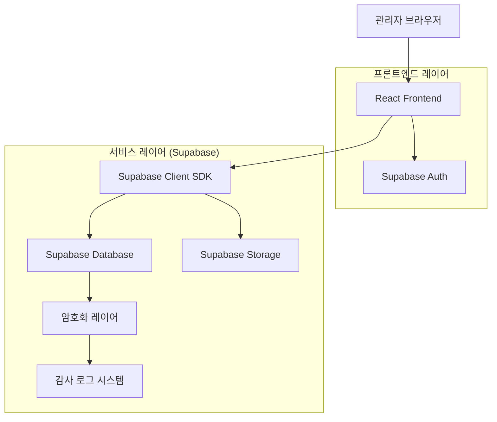
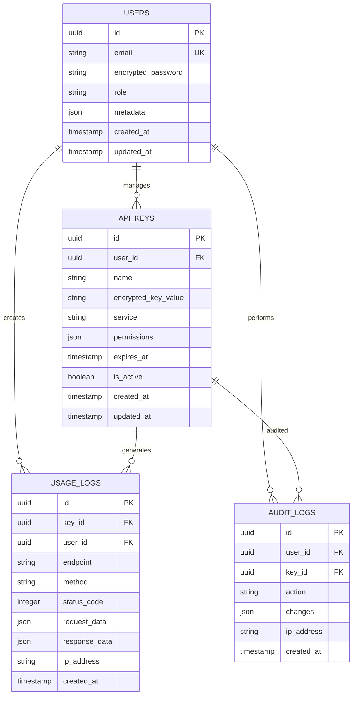

## 1. 아키텍처 설계



## 2. 기술 설명

* **프론트엔드**: React\@18 + TypeScript + TailwindCSS\@3 + Vite

* **초기화 도구**: vite-init

* **백엔드**: Supabase (인증, 데이터베이스, 스토리지)

* **상태 관리**: Zustand

* **폼 관리**: React Hook Form + Zod

* **암호화**: crypto-js (AES-256-GCM)

* **날짜 처리**: date-fns

* **차트**: Recharts

* **테이블**: TanStack Table

## 3. 라우트 정의

| 라우트             | 목적                        |
| --------------- | ------------------------- |
| /admin          | 관리자 대시보드, API 키 현황 및 통계   |
| /admin/keys     | API 키 관리 페이지, 등록/수정/삭제 기능 |
| /admin/usage    | 사용 내역 조회, 필터링 및 검색        |
| /admin/audit    | 감사 로그 확인, 변경 이력 추적        |
| /admin/settings | 보안 설정, 백업 관리, 알림 설정       |
| /login          | 관리자 인증 페이지                |
| /unauthorized   | 권한 없음 페이지                 |

## 4. API 정의

### 4.1 인증 API

**관리자 로그인**

```
POST /auth/login
```

요청:

| 파라미터     | 타입      | 필수    | 설명        |
| -------- | ------- | ----- | --------- |
| email    | string  | true  | 관리자 이메일   |
| password | string  | true  | 비밀번호      |
| remember | boolean | false | 자동 로그인 유지 |

응답:

| 파라미터    | 타입     | 설명                  |
| ------- | ------ | ------------------- |
| user    | object | 사용자 정보              |
| session | object | 세션 토큰               |
| role    | string | 사용자 역할 (admin/user) |

### 4.2 API 키 관리

**키 등록**

```
POST /api/keys
```

요청:

| 파라미터        | 타입     | 필수    | 설명             |
| ----------- | ------ | ----- | -------------- |
| name        | string | true  | 키 이름           |
| key\_value  | string | true  | API 키 값 (암호화됨) |
| service     | string | true  | 서비스 제공자        |
| permissions | array  | true  | 권한 범위          |
| expires\_at | string | false | 만료일시           |

**키 조회**

```
GET /api/keys
```

쿼리 파라미터:

| 파라미터   | 타입     | 필수    | 설명        |
| ------ | ------ | ----- | --------- |
| page   | number | false | 페이지 번호    |
| limit  | number | false | 페이지당 항목 수 |
| search | string | false | 검색어       |
| status | string | false | 상태 필터     |

### 4.3 사용 내역

**내역 조회**

```
GET /api/usage
```

쿼리 파라미터:

| 파라미터        | 타입     | 필수    | 설명        |
| ----------- | ------ | ----- | --------- |
| start\_date | string | false | 시작일       |
| end\_date   | string | false | 종료일       |
| key\_id     | string | false | 키 ID 필터   |
| user\_id    | string | false | 사용자 ID 필터 |
| status      | string | false | 성공/실패 필터  |

## 5. 데이터 모델

### 5.1 데이터베이스 스키마



### 5.2 데이터 정의 언어

**사용자 테이블 (users)**

```sql
-- 테이블 생성
CREATE TABLE users (
    id UUID PRIMARY KEY DEFAULT gen_random_uuid(),
    email VARCHAR(255) UNIQUE NOT NULL,
    encrypted_password VARCHAR(255) NOT NULL,
    role VARCHAR(20) DEFAULT 'user' CHECK (role IN ('admin', 'user')),
    metadata JSONB DEFAULT '{}',
    created_at TIMESTAMP WITH TIME ZONE DEFAULT NOW(),
    updated_at TIMESTAMP WITH TIME ZONE DEFAULT NOW()
);

-- 인덱스 생성
CREATE INDEX idx_users_email ON users(email);
CREATE INDEX idx_users_role ON users(role);

-- RLS 정책
ALTER TABLE users ENABLE ROW LEVEL SECURITY;

-- 관리자만 전체 접근 가능
CREATE POLICY "관리자는 모든 사용자 조회 가능" ON users
    FOR SELECT USING (
        EXISTS (
            SELECT 1 FROM users 
            WHERE id = auth.uid() AND role = 'admin'
        )
    );

-- 사용자는 자신의 정보만 접근 가능
CREATE POLICY "사용자는 자신의 정보만 조회 가능" ON users
    FOR SELECT USING (id = auth.uid());
```

**API 키 테이블 (api\_keys)**

```sql
-- 테이블 생성
CREATE TABLE api_keys (
    id UUID PRIMARY KEY DEFAULT gen_random_uuid(),
    user_id UUID NOT NULL REFERENCES users(id) ON DELETE CASCADE,
    name VARCHAR(100) NOT NULL,
    encrypted_key_value TEXT NOT NULL,
    service VARCHAR(50) NOT NULL,
    permissions JSONB DEFAULT '[]',
    expires_at TIMESTAMP WITH TIME ZONE,
    is_active BOOLEAN DEFAULT true,
    created_at TIMESTAMP WITH TIME ZONE DEFAULT NOW(),
    updated_at TIMESTAMP WITH TIME ZONE DEFAULT NOW()
);

-- 인덱스 생성
CREATE INDEX idx_api_keys_user_id ON api_keys(user_id);
CREATE INDEX idx_api_keys_service ON api_keys(service);
CREATE INDEX idx_api_keys_is_active ON api_keys(is_active);
CREATE INDEX idx_api_keys_expires_at ON api_keys(expires_at);

-- RLS 정책
ALTER TABLE api_keys ENABLE ROW LEVEL SECURITY;

-- 권한 설정
GRANT SELECT ON api_keys TO anon;
GRANT ALL PRIVILEGES ON api_keys TO authenticated;

-- 정책 정의
CREATE POLICY "인증된 사용자는 자신의 키만 조회 가능" ON api_keys
    FOR SELECT USING (
        user_id = auth.uid() OR 
        EXISTS (
            SELECT 1 FROM users 
            WHERE id = auth.uid() AND role = 'admin'
        )
    );

CREATE POLICY "관리자는 모든 키 관리 가능" ON api_keys
    FOR ALL USING (
        EXISTS (
            SELECT 1 FROM users 
            WHERE id = auth.uid() AND role = 'admin'
        )
    );
```

**사용 내역 테이블 (usage\_logs)**

```sql
-- 테이블 생성
CREATE TABLE usage_logs (
    id UUID PRIMARY KEY DEFAULT gen_random_uuid(),
    key_id UUID NOT NULL REFERENCES api_keys(id) ON DELETE CASCADE,
    user_id UUID NOT NULL REFERENCES users(id) ON DELETE CASCADE,
    endpoint VARCHAR(255) NOT NULL,
    method VARCHAR(10) NOT NULL,
    status_code INTEGER NOT NULL,
    request_data JSONB DEFAULT '{}',
    response_data JSONB DEFAULT '{}',
    ip_address INET,
    created_at TIMESTAMP WITH TIME ZONE DEFAULT NOW()
);

-- 인덱스 생성
CREATE INDEX idx_usage_logs_key_id ON usage_logs(key_id);
CREATE INDEX idx_usage_logs_user_id ON usage_logs(user_id);
CREATE INDEX idx_usage_logs_created_at ON usage_logs(created_at DESC);
CREATE INDEX idx_usage_logs_status_code ON usage_logs(status_code);

-- RLS 정책
ALTER TABLE usage_logs ENABLE ROW LEVEL SECURITY;

-- 권한 설정
GRANT SELECT ON usage_logs TO authenticated;

CREATE POLICY "관리자는 모든 사용 내역 조회 가능" ON usage_logs
    FOR SELECT USING (
        EXISTS (
            SELECT 1 FROM users 
            WHERE id = auth.uid() AND role = 'admin'
        )
    );
```

**감사 로그 테이블 (audit\_logs)**

```sql
-- 테이블 생성
CREATE TABLE audit_logs (
    id UUID PRIMARY KEY DEFAULT gen_random_uuid(),
    user_id UUID NOT NULL REFERENCES users(id) ON DELETE CASCADE,
    key_id UUID REFERENCES api_keys(id) ON DELETE CASCADE,
    action VARCHAR(50) NOT NULL,
    changes JSONB DEFAULT '{}',
    ip_address INET,
    created_at TIMESTAMP WITH TIME ZONE DEFAULT NOW()
);

-- 인덱스 생성
CREATE INDEX idx_audit_logs_user_id ON audit_logs(user_id);
CREATE INDEX idx_audit_logs_key_id ON audit_logs(key_id);
CREATE INDEX idx_audit_logs_action ON audit_logs(action);
CREATE INDEX idx_audit_logs_created_at ON audit_logs(created_at DESC);

-- RLS 정책
ALTER TABLE audit_logs ENABLE ROW LEVEL SECURITY;

-- 권한 설정
GRANT SELECT ON audit_logs TO authenticated;

CREATE POLICY "관리자는 모든 감사 로그 조회 가능" ON audit_logs
    FOR SELECT USING (
        EXISTS (
            SELECT 1 FROM users 
            WHERE id = auth.uid() AND role = 'admin'
        )
    );
```

## 6. 보안 구현

### 6.1 암호화 구현

```typescript
// AES-256-GCM 암호화 유틸리티
import CryptoJS from 'crypto-js';

class EncryptionService {
    private key: string;
    
    constructor(encryptionKey: string) {
        this.key = encryptionKey;
    }
    
    encrypt(text: string): string {
        return CryptoJS.AES.encrypt(text, this.key).toString();
    }
    
    decrypt(encryptedText: string): string {
        const bytes = CryptoJS.AES.decrypt(encryptedText, this.key);
        return bytes.toString(CryptoJS.enc.Utf8);
    }
}
```

### 6.2 접근 제어

* JWT 기반 인증

* 역할 기반 권한 관리 (RBAC)

* IP 제한 및 지리적 차단

* 2단계 인증 (2FA) 지원

* 세션 관리 및 자동 로그아웃

### 6.3 모니터링 및 알림

* 실시간 보안 이벤트 모니터링
  -異常 접속 시도 알림

* 키 만료 전 알림

* 시스템 이상 징후 탐지

